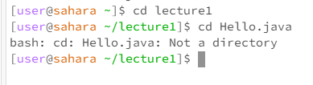

Lab Report 1 

Benjamin Scheerger

Cse-15L

# `cd` no arguments

* directory is `/home`.
* This command ran with no arguments does nothing if not in any directory, which is why I got this output, but if I had already cd'd into lecture 1 it would have taken me back to user.
* This output is not an error.

# `cd` directory

* directory is `/home/lecture1`.
* This command ran with a directory argument changes the working directory into the argument you ran this command with.
* This output is not an error.

# `cd` file

* directory is `/home/lecture1`.
* This command with a file argument throws an error message because the cd command can't access files.
* This output is an error.

# `ls` no arguments

* directory is `/home`.
* The output is all files and directorys in the current working directory, so because I am in home it returns just lecture1.
* This output is not an error.

# `ls` directory

* directory is `/home`.
* This output gives all of the files and directory's contained in the lecture 1 directory.
* This output is not an error.

# `ls` file
 
* directory is `/home/lecture1`.
* The output we got is just returning the file that we entered to show that is in the directory, if not an error would have been thrown.
* This output is not an error.

# `cat` no arguments
 
* directory is `/home`.
* This output basically just returns whatever the user inputs until you ctrl c out of it, because cat has no arguments here.
* This output is not an error, but is also not how cat is meant to be used.

# `cat` directory
 
* directory is `/home`.
* This output is given because cat is intended to be used on files and this was used on a directory, throwing an error.
* This output is an error because cat doesn't work on directories.

# `cat` file
 
* directory is `/home/lecture1`.
* This output is given because cat returns the contents of the file used in the argument, in this case `Hello.java`.
* This output is not an error.

