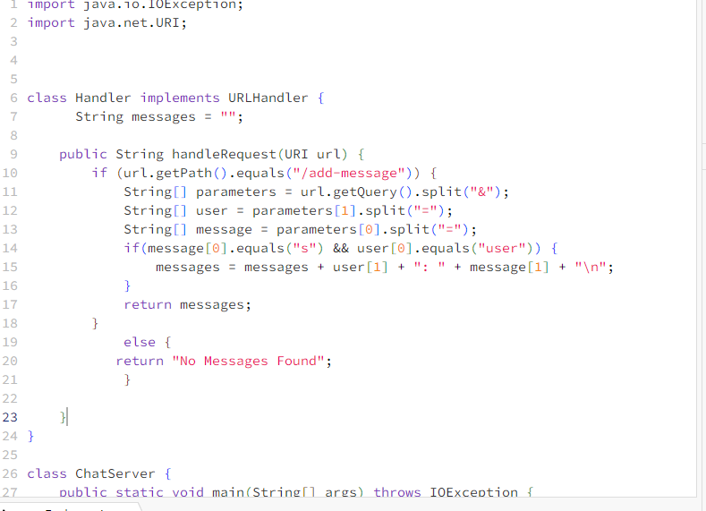
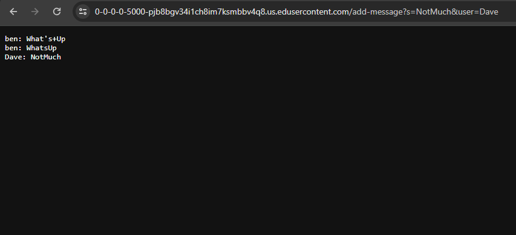
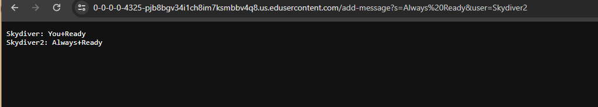
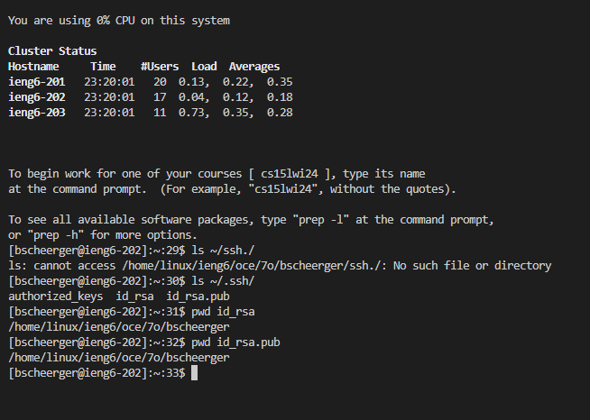
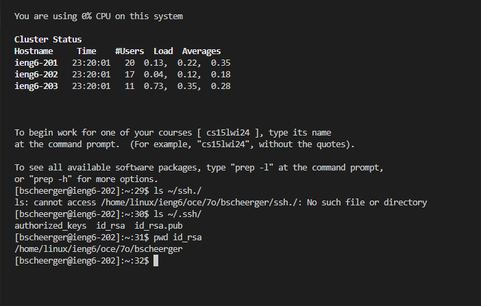
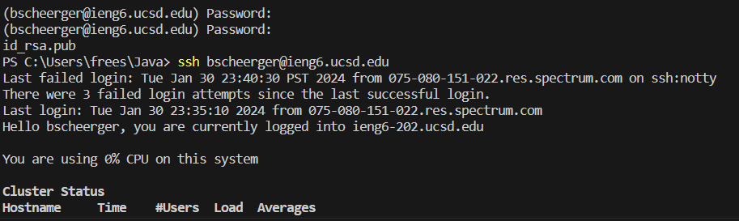

Lab Report 2

Benjamin Scheerger

Cse-15L

# `ChatServer` Code

# Add Message 1

* The only method in my code that is called in this example is `handlerRequest`, which takes input from the add-message path, and adds it to an already existing string to print out the messages. `handlerRequest` is in the `Handler` class, which implements `URLhandler`.
* The relevant arguments to this method are the `user` and `message` arguments, as it takes those and formats them into chats. The values of `user` and `message` for this screenshot are Dave and NotMuch respectively, and the string `messages`, already had the user Ben saying Whats Up and WhatsUp before this `add-message` request was executed.
* The value of the initial string `messages` is changed by this request, because this is where the chat history is stored and where the text showing up on the server is printed from.

# Add Message 2

* The only method in my code that is called in this example is `handlerRequest`, which takes input from the add-message path, and adds it to an already existing string to print out the messages. `handlerRequest` is in the `Handler` class, which implements `URLhandler`.
* The relevant arguments to this method are the `user` and `message` arguments, as it takes those and formats them into chats. The values of `user` and `message` for this screenshot are Skydiver2 and Always Ready respectively, and the string `messages`, already had the user Skydiver saying You Ready before this `add-message` request was executed.
* The value of the initial string `messages` is changed by this request, because this is where the chat history is stored and where the text showing up on the server is printed from.

# Public Key

# Private Key

# No Password

In Lab 3, I learned a lot of things that I didn't know before. I think one of the most important ones is how to open a local server on vs code, as previously I had only done this on edstem, and being able to use vs code for this opens a lot of possibilities. I also had no idea you could set up a local passkey for ssh login, which saves a lot of time and removes the tedium of logging in every time.
