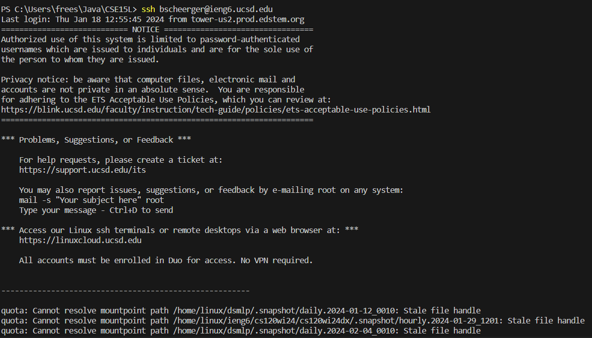
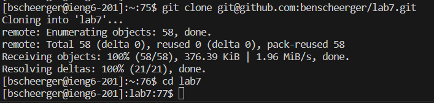
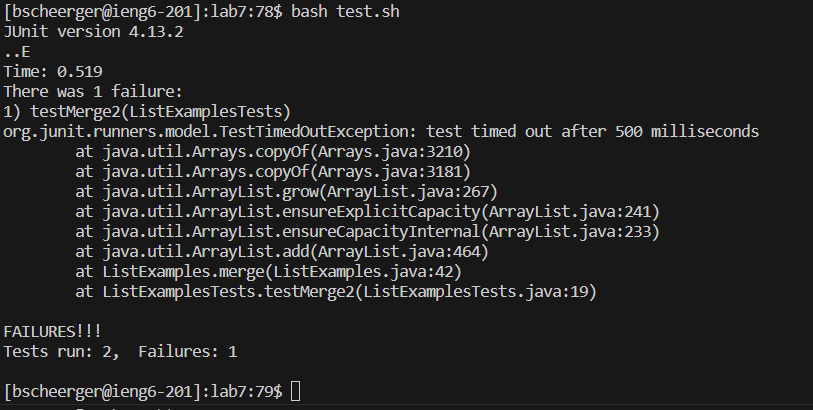
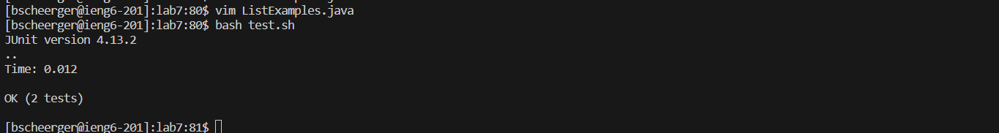
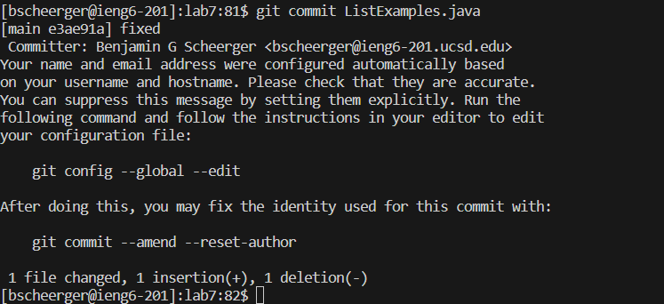

Lab Report 4

Benjamin Scheerger

Cse-15L

# Vim
## Logging into Ieng6

Keys Pressed: `ssh <space> bscheerger@ieng6.ucsd.edu <enter>`. The first step was to log into my ieng6 account, so I typed out the command in order to log in. I have an `ssh` key set on my computer so there was no need to enter my password. 

## Cloning Repository
  
Keys Pressed: `git <space> clone <ctrl+shift+V> <enter> cd <space> lab7 `. To clone my fork of lab7, I typed `git clone` and then pasted `git@github.com:benscheerger/lab7.git`, the `ssh` link to my fork. I then typed `cd lab7` in order to enter the directory I just created.

## Running Test File

Keys Pressed: `<up><up><up><up><up><up><up><up><up><up><enter>`. In order to run the test file, I needed the command `bash test.sh`, which was seven commands up in the search history, so I pressed `<up>` nine times and then pressed `<enter>` to run the command. As seen in the image above, the test `testMerge2` fails.

## Editing `ListExamples.java`

Keys Pressed: `<up><up><up><up><up><up><up><up><up><enter> j j j j j l l l l l x i 2 <esc> :wq <enter>`. To edit the file, I first needed the command `vim ListExamples.java`, which was eight commands up in the search history. After running that command, I used the `vim` controls `j` and `l` to navigate to the line that needed fixing, then `x` to delete the character that needed replacing, `i` to enter insert mode, `2` as the new character, and then finally `:wq <enter>` to save the file and exit `vim`. The screenshot above is from before I pressed `<enter>` to show the `vim` editing.

## Running the Tests Again

Keys Pressed: `<up><up><enter>`. The command to run the tests, `bash test.sh`, was two up in the search history.

## Commit and Push to Github
   
Keys Pressed: `<up><up><up><up><up><up><enter> i fixed <esc> :wq <enter>`. The command to commit this file to Github, `git commit ListExamples.java`, was six up in the search history. After I ran this command, I used `i` to enter insert mode for my commit message, typed `fixed` as my message, and then saved and exited in `vim` to push the file to Github. 
