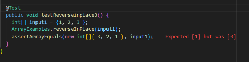

Lab Report 2

Benjamin Scheerger

Cse-15L

# Buggy Code

Failure Inducing Input 

 ` @Test 
	public void testReverseinplace3() {
    int[] input1 = {1, 2, 3 };
    ArrayExamples.reverseInPlace(input1);
    assertArrayEquals(new int[]{ 3, 2, 1 }, input1);
	}`

 Passing Input 

 `@Test 
	public void testReverseInPlace() {
    int[] input1 = { 3 };
    ArrayExamples.reverseInPlace(input1);
    assertArrayEquals(new int[]{ 3 }, input1);
	}`

 Failure Symptom
 

 Bugged Code
 
  `static void reverseInPlace(int[] arr) {
    for(int i = 0; i < arr.length; i += 1) {
      arr[i] = arr[arr.length - i - 1];
    }
  }`

 Fixed Code
 
 `  static void reverseInPlace(int[] arr) {
    int[] newArray = new int[arr.length];
    for(int i = 0; i < arr.length; i += 1) {
      newArray[i] = arr[i];
    }
    for (int i = 0; i < arr.length; i+=1) {
      arr[i] = newArray[arr.length - i -1];
    }
  }`

  The fix for this code addresses the issue of actively changing the array as it is reversed. In the original code, `arr[i] = arr[arr.length - i - 1]` is changing `arr` as it reverses it, so the addition of `newArray` as a deep copy of the original array, makes it so `arr` can be accurately reversed. 

# Find Command
 
